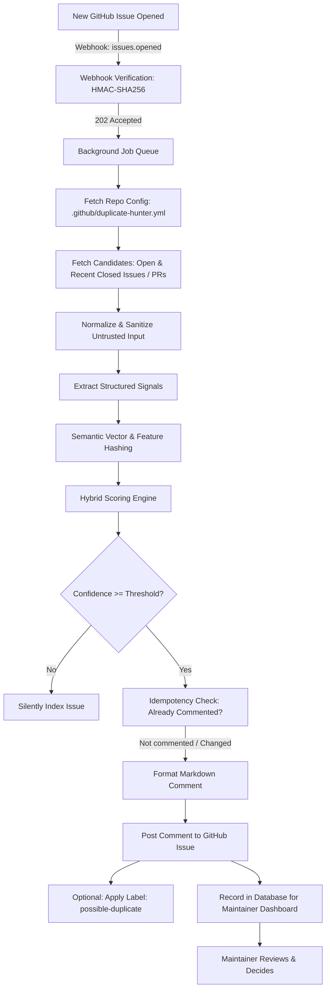

# Duplicate Hunter Architecture & Technical Design

## 1. Overview

**Duplicate Hunter** is an AI-assisted GitHub App that identifies duplicate or highly related GitHub Issues and Pull Requests.

> **Core Axiom:** Duplicate Hunter must **never automatically close an issue or PR** based solely on AI analysis.
>
> Workflow: **Detect → Explain → Suggest → Maintainer decides**

---

## 2. End-to-End Pipeline



---

## 3. Structured Signal Analysis

Rather than relying purely on a single opaque black-box similarity number (e.g. `Similarity: 93%`), Duplicate Hunter deconstructs issues into explicit, verifiable engineering signals:

```text
├── Exception Signatures (NullReferenceException, TypeError, panic)
├── Stack Trace Locations (Top frames, filenames, line numbers)
├── Component Tags (CSV import, authentication, cache, db migration)
├── Operating Environments (Windows 11 vs Windows 10, Ubuntu, macOS)
├── Version Numbers (v2.1.0 vs v1.4.0)
├── Reproduction Steps (Step-by-step token overlaps)
├── Referenced Code Files (e.g. src/parser/csv.ts)
└── Label Overlaps (bug, crash, ui)
```

### Dynamic Weighted Scoring Formula

$$\text{ActiveWeight} = \sum_{s \in \text{ApplicableSignals}} W_s$$

$$\text{NormalizedScore} = \frac{\sum_{s \in \text{ApplicableSignals}} \text{Sim}_s \times W_s}{\text{ActiveWeight}} + \text{Bonus}_{\text{direct\_matches}}$$

- **Bonus Direct Matches:** Direct exception matches ($+0.15$), matching component names ($+0.08$), or matching stack frame lines ($+0.10$).
- **Confidence Classification:**
  - $\text{Score} \ge 0.80 \implies \mathbf{High}$
  - $0.65 \le \text{Score} < 0.80 \implies \mathbf{Medium}$
  - $\text{Score} < 0.65 \implies \mathbf{Low}$ (No comment posted)

---

## 4. Provider-Independent AI Layer

The embedding and analysis layer conforms to strict TypeScript interfaces:

```typescript
export interface EmbeddingProvider {
  generateEmbedding(text: string): Promise<number[]>;
  generateEmbeddings(texts: string[]): Promise<number[][]>;
}

export interface AnalysisProvider {
  analyzeIssue(input: AnalysisInput): Promise<AnalysisResult>;
}
```

Implementations:
1. `LocalEmbeddingProvider`: Deterministic subword feature-hashing dense embeddings (128 dims) with L2 normalization. 100% offline, zero-network, zero latency.
2. `OpenAIEmbeddingProvider`: OpenAI API `text-embedding-3-small` with automatic local fallback.
3. `OllamaEmbeddingProvider`: Local LLM endpoints (`nomic-embed-text`, `llama3`).
4. `HybridAnalysisProvider`: Fuses semantic embeddings with deep regex signal extractors.
